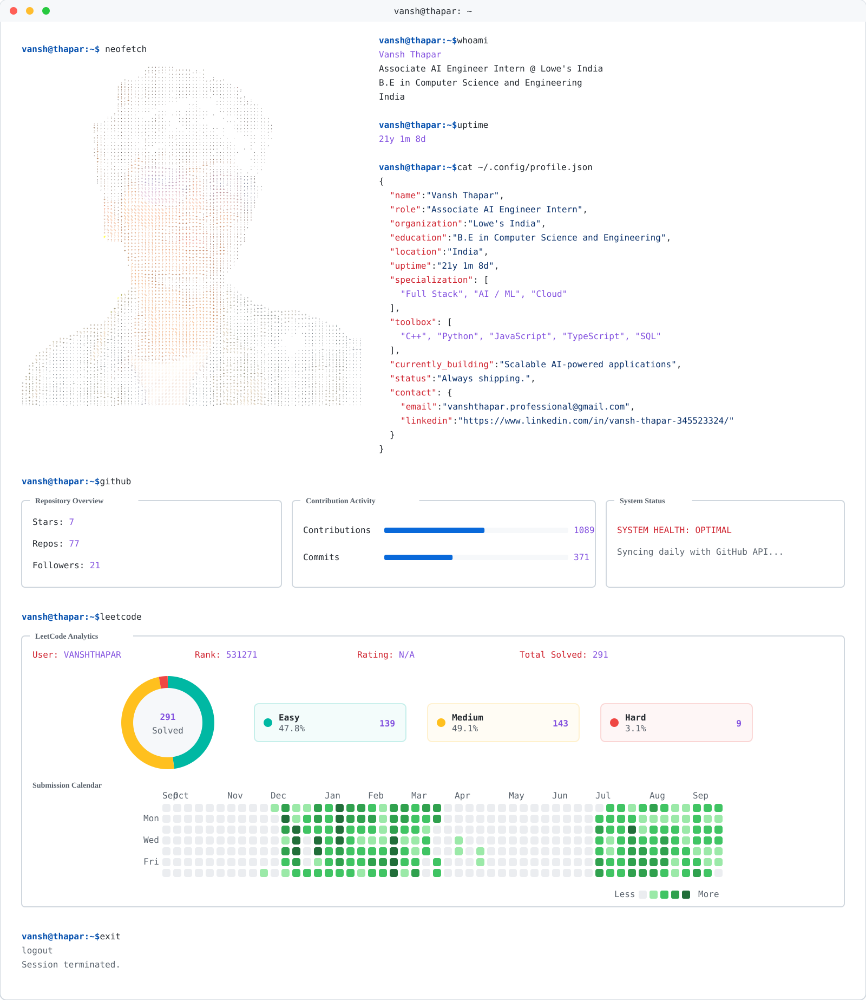

# Vansh Thapar

### Associate AI Engineer Intern @ Lowe's India

Welcome to my personal GitHub profile! I'm a passionate engineer currently pursuing a Bachelor of Engineering in Computer Science at Chitkara University. I love building AI products, solving competitive programming challenges, and contributing to Open Source. 

---

## 🚀 Terminal Profile

<picture>
  <source media="(prefers-color-scheme: dark)" srcset="assets/dark_mode.svg">
  <source media="(prefers-color-scheme: light)" srcset="assets/light_mode.svg">
  
</picture>

---

---

## 📈 GitHub Contribution Graph

---

## 🛠️ Tech Stack & Technologies

**Languages**: C++, Java, Python, JavaScript, TypeScript, SQL  
**Frameworks & Libraries**: React, Node.js, Express, FastAPI, Flask, LangChain, LangGraph  
**Databases**: MongoDB, PostgreSQL, MySQL, Supabase, BigQuery  
**Tools & DevOps**: Docker, Git, GitHub Actions, Apache Airflow, Apache Spark, PySpark  
**Cloud**: AWS, Google Cloud Platform

---

## 🔗 Connect With Me

- **LinkedIn**: [linkedin.com/in/vansh-thapar-345523324](https://www.linkedin.com/in/vansh-thapar-345523324/)
- **Email**: [vanshthapar.professional@gmail.com](mailto:vanshthapar.professional@gmail.com)
- **Portfolio**: Coming Soon

---

## ⚙️ Setup Instructions

To use this profile generator on your own GitHub account:
1. Ensure your portrait is saved as `assets/portrait.svg`.
2. Add the following **Repository Secrets** in your GitHub repository settings (`Settings > Secrets and variables > Actions`):
   - `GH_TOKEN` (A Personal Access Token with `read:user` and `repo` scopes)
   - `GH_USERNAME` (Your GitHub username)
   - `LEETCODE_USERNAME` (Your LeetCode username)
3. Trigger the `Update Profile SVGs` workflow manually or wait for the midnight schedule!

---

  

